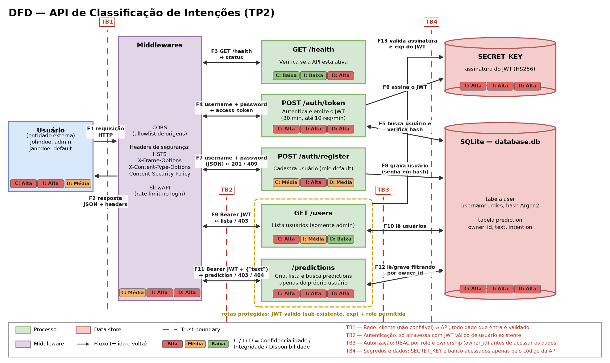

# DFD e Tríade CIA — API de Classificação de Intenções (TP2)

Esta versão atualiza o DFD do TP1 para a API do TP2. Agora a API tem banco SQLite com usuários e predictions, controle de acesso por role e por dono do recurso, middlewares de segurança e rate limiting no login.

Atendendo ao feedback do TP1, a classificação na tríade CIA aparece **no próprio diagrama**. Cada componente tem três selos (C, I e D) com o nível Alta, Média ou Baixa, nas cores da legenda. A justificativa de cada nível está na tabela "Como cada componente se classifica na tríade CIA?".

---

## Quais são os componentes do DFD?

| Tipo | Componente | Descrição |
|---|---|---|
| Entidade externa | **Usuário** | Cliente da API. No seed existem `johndoe` (roles `default` e `admin`) e `janedoe` (role `default`) |
| Processo | **Middlewares** | CORS com allowlist de origens, headers de segurança (HSTS, X-Frame-Options, X-Content-Type-Options, Content-Security-Policy) e SlowAPI. Toda requisição passa por eles |
| Processo | **GET /health** | Verifica se a API está ativa. Rota pública |
| Processo | **POST /auth/token** | Autentica o usuário (hash Argon2) e emite um JWT HS256 válido por 30 minutos. Limitada a 10 requisições por minuto por cliente |
| Processo | **POST /auth/register** | Cadastra um novo usuário, com senha em hash e role `default` |
| Processo | **GET /users** | Lista os usuários. Exige JWT válido e role `admin` |
| Processo | **/predictions** | `POST /predictions/predict`, `GET /predictions` e `GET /predictions/{id}`. Exige JWT válido e só dá acesso às predictions cujo `owner_id` é o do usuário autenticado |
| Data store | **SQLite (`database.db`)** | Tabela `user` (username, roles, e-mail, hash da senha) e tabela `prediction` (owner_id, texto, intenção, data) |
| Data store | **SECRET_KEY** | Chave usada para assinar e verificar os JWTs (HS256) |

---

## Quais são as entradas do sistema?

| Fluxo | Entrada | Origem | Destino |
|---|---|---|---|
| F1 | Requisição HTTP (credenciais, JWT ou corpo JSON) | Usuário | Middlewares |
| F3 | `GET /health`, sem credenciais | Middlewares | `GET /health` |
| F4 | `username` + `password` (form-urlencoded) | Middlewares | `POST /auth/token` |
| F5 | Usuário e hash Argon2, para comparação | SQLite | `POST /auth/token` |
| F6 | `SECRET_KEY`, para assinar o token | SECRET_KEY | `POST /auth/token` |
| F7 | `username` + `password` (JSON, `extra='forbid'`) | Middlewares | `POST /auth/register` |
| F9 | Header `Authorization: Bearer <JWT>` | Middlewares | `GET /users` |
| F10 | Lista de usuários | SQLite | `GET /users` |
| F11 | Header `Authorization: Bearer <JWT>` + corpo `{"text": "..."}` (`extra='forbid'`) | Middlewares | `/predictions` |
| F12 | Predictions filtradas pelo `owner_id` do usuário autenticado | SQLite | `/predictions` |
| F13 | `SECRET_KEY`, para verificar assinatura e `exp` do JWT | SECRET_KEY | Rotas protegidas |

---

## Quais são as saídas do sistema?

| Fluxo | Saída | Origem | Destino |
|---|---|---|---|
| F2 | Resposta JSON com os headers de segurança | Middlewares | Usuário |
| F3 | `200 {"details": "Conectado à API."}` | `GET /health` | Middlewares |
| F4 | `200 {"access_token", "token_type"}`, `401`, `404` ou `429` | `POST /auth/token` | Middlewares |
| F7 | `201`, `409` (usuário já existe) ou `422` (campo extra) | `POST /auth/register` | Middlewares |
| F8 | Novo usuário com senha em hash | `POST /auth/register` | SQLite |
| F9 | Lista de usuários, `401` ou `403` | `GET /users` | Middlewares |
| F11 | Prediction, `401`, `403` (recurso de outro usuário), `404` ou `422` | `/predictions` | Middlewares |
| F12 | Nova prediction gravada com `owner_id` do usuário autenticado | `/predictions` | SQLite |

---

## Onde estão as trust boundaries?

| Fronteira | Separa | Fluxos que atravessa | O que muda ao atravessar |
|---|---|---|---|
| **TB1 — Rede** | Cliente e rede (não confiáveis) × aplicação FastAPI | F1, F2 | Todo dado que entra é não confiável. Os middlewares aplicam CORS, headers e rate limit, e o Pydantic rejeita campos extras (`422`). O transporte local é HTTP, sem TLS |
| **TB2 — Autenticação** | Middlewares × rotas protegidas (`/users`, `/predictions`) | F9, F11 | Só atravessa com um JWT íntegro, não expirado, com `sub` e `exp` presentes e cujo `sub` corresponda a um usuário cadastrado. Caso contrário, `401` |
| **TB3 — Autorização** | Rotas protegidas × dados no banco | F10, F12 | O RBAC confere a role (`/users` só para `admin`) e as consultas filtram pelo `owner_id`. Acesso a recurso de outro usuário retorna `403` (proteção contra BOLA) |
| **TB4 — Segredos e dados** | Código da aplicação × SECRET_KEY e banco SQLite | F5, F6, F8, F10, F12, F13 | Acesso a material sensível. A `SECRET_KEY` ainda está fixa no código versionado, o que enfraquece essa fronteira |

---

## O que é confidencial?

- **Senhas dos usuários**: são o segredo primário. No banco só fica o hash Argon2.
- **`SECRET_KEY`**: quem a obtém consegue forjar tokens válidos para qualquer usuário, inclusive o admin.
- **Hashes armazenados no SQLite**: não devem ser expostos, mesmo sendo derivados.
- **Token JWT**: é uma credencial *bearer*, quem o possui age como o usuário.
- **Textos das predictions**: podem conter dados do cliente final e pertencem a um único usuário. Um usuário não pode ler as predictions de outro.
- **Lista de usuários**: e-mails e nomes só podem ser vistos pelo admin.

Fora do escopo de confidencialidade: a resposta de `/health` e a documentação Swagger, que são públicas.

---

## O que precisa de integridade?

- **`SECRET_KEY`**: se for alterada ou substituída, a verificação de assinatura perde o valor.
- **Token JWT**: a assinatura HS256 detecta adulteração de `sub` e `exp`.
- **Tabela `user`**: alterar um hash troca a senha; alterar `user_roles` concede privilégios de admin.
- **Campo `owner_id` das predictions**: é o que define o dono. Ele é preenchido pela API a partir do token, nunca pelo corpo da requisição.
- **Validação do JWT e RBAC**: implementam a TB2 e a TB3; uma falha aqui derruba toda a autorização.
- **Corpo das requisições**: o `extra='forbid'` impede que campos não previstos, como `role` ou `owner_id`, sejam aceitos.
- **Headers de segurança**: garantem que o navegador aplique as proteções (CSP, HSTS, anti-clickjacking).

---

## O que deve estar disponível?

- **Processo servidor (FastAPI/Uvicorn) e middlewares**: se caem, todos os componentes caem junto.
- **`GET /health`**: é o próprio mecanismo de aferir disponibilidade.
- **`POST /auth/token`**: sem emissão de token, nenhuma rota protegida pode ser usada. O rate limit protege contra força bruta, mas também pode bloquear temporariamente um usuário legítimo que erre a senha várias vezes.
- **`/predictions`**: é a função de negócio da API.
- **SQLite e `SECRET_KEY`**: precisam estar acessíveis para autenticar usuários e servir as predictions.

---

## Como cada componente se classifica na tríade CIA?

| Componente | Confidencialidade | Integridade | Disponibilidade |
|---|---|---|---|
| **Usuário** | Alta: credenciais e token não podem ser expostos | Alta: a identidade não pode ser assumida por terceiros | Média: precisa conseguir se autenticar quando necessário |
| **Middlewares** | Média: não guardam dados, mas os headers protegem o que o navegador expõe | Alta: aplicam CORS, CSP e as demais políticas a toda resposta | Alta: todo o tráfego passa por eles, e o rate limit protege a disponibilidade do login |
| **GET /health** | Baixa: não expõe dado sensível | Baixa: resposta constante | Alta: é o indicador de que a API está no ar |
| **POST /auth/token** | Alta: recebe senhas e emite tokens | Alta: falha aqui concede acesso indevido | Alta: sem ele ninguém obtém token |
| **POST /auth/register** | Média: recebe senha, mas não expõe dados de outros usuários | Alta: não pode permitir criar usuário com role `admin` | Média: não é necessário para quem já tem conta |
| **GET /users** | Alta: expõe dados de todos os usuários e por isso é restrita ao admin | Média: é apenas leitura | Baixa: é uma função administrativa e não faz parte do fluxo principal |
| **/predictions** | Alta: um usuário não pode ver predictions de outro (BOLA) | Alta: o `owner_id` não pode ser forjado | Alta: é a função principal da API |
| **SQLite (`database.db`)** | Alta: contém hashes de senha e textos dos usuários | Alta: alterações mudam senhas, roles e donos dos recursos | Alta: sem ele não há login nem predictions |
| **SECRET_KEY** | Alta: quem a lê consegue forjar tokens válidos | Alta: alterá-la invalida todas as sessões emitidas | Alta: sem ela não se emite nem se valida token |

---

## Quais fragilidades o DFD evidencia?

| Onde | Fragilidade | Propriedade afetada |
|---|---|---|
| SECRET_KEY (TB4) | Chave fixa no código e versionada no repositório, o que permite forjar tokens válidos | Integridade, Confidencialidade |
| TB1 | Em ambiente local o tráfego é HTTP, sem TLS: senha e token circulam em claro. O HSTS só tem efeito sobre HTTPS | Confidencialidade |
| POST /auth/token | Respostas diferentes para usuário inexistente (`404`) e senha errada (`401`) permitem descobrir quais usernames existem | Confidencialidade |
| POST /auth/register | Rota pública, sem limite de requisições: permite criar contas em massa | Disponibilidade, Integridade |
| Token JWT | Sem revogação: um token vazado continua válido até expirar (30 min) | Confidencialidade, Integridade |
| Campo `text` | Sem limite de tamanho, permitindo payloads muito grandes | Disponibilidade |
| Swagger (`/docs`) | Depende do CDN jsDelivr; se o CDN cair, a documentação não carrega (a API continua funcionando) | Disponibilidade |

---

## Quais controles já estão implementados?

| Controle | Onde | Propriedade reforçada |
|---|---|---|
| Senhas armazenadas como hash Argon2 | `security/auth.py`, `sqlite_database.py` | Confidencialidade |
| JWT HS256 com `exp` de 30 minutos, com `sub` e `exp` obrigatórios na decodificação | `security/auth.py` | Integridade, Confidencialidade |
| `sub` do token conferido contra os usuários do banco antes de liberar o acesso | `security/auth.py` | Integridade |
| RBAC por role (`/users` somente para admin) | `security/rbac.py`, `routes/user.py` | Confidencialidade, Integridade |
| Controle por ownership: `owner_id` preenchido pelo token e verificado no acesso por ID (`403`) | `routes/prediction.py` | Confidencialidade, Integridade |
| Modelos Pydantic com `extra='forbid'` (`422` para campos extras) | `models/` | Integridade |
| Consultas com SQLModel, sem SQL raw | `routes/`, `security/auth.py` | Integridade, Confidencialidade |
| Headers HSTS, X-Frame-Options, X-Content-Type-Options e Content-Security-Policy | `main.py` | Integridade, Confidencialidade |
| Swagger com versão fixa e SRI, sem script inline | `routes/docs.py` | Integridade |
| CORS com allowlist explícita de origens | `main.py` | Confidencialidade, Integridade |
| Rate limit de 10 requisições/minuto em `/auth/token` (SlowAPI) | `routes/auth.py`, `limiter.py` | Disponibilidade, Confidencialidade |
| Scan passivo OWASP ZAP sem findings Medium/High | `zap/` | Todas |
